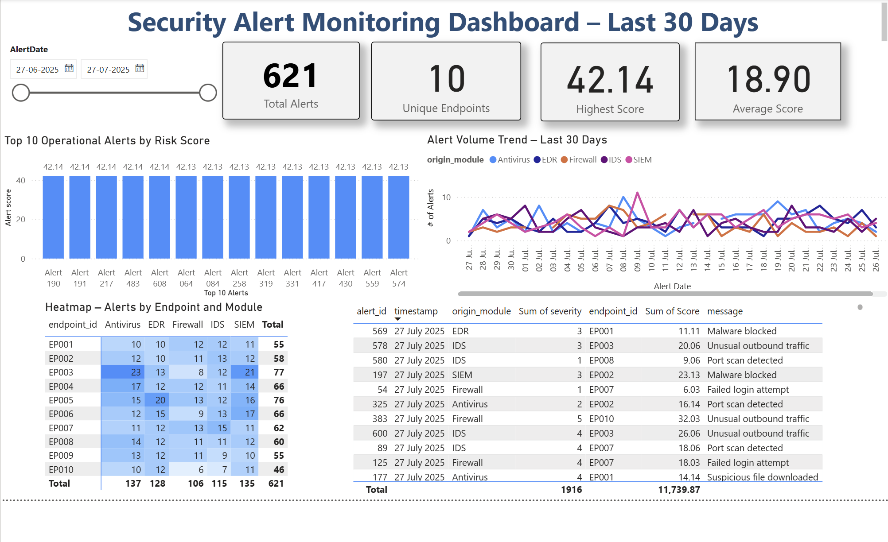

# Alert-Dashboard
# 🚨 Operational Alert Prioritization Dashboard

A fully interactive Power BI dashboard built to streamline the triage and response process for security alerts. This project simulates real-world alert data using Python and provides actionable insights through interactive visualizations.

---

## 📊 Overview

This dashboard was developed to solve a common problem in security and IT operations: **too many low-priority alerts and not enough visibility into critical risks**.

Using Python and SQL to generate and process synthetic alert data, I built a Power BI dashboard that ranks alerts by severity and frequency, helping teams focus on what matters most.

---

## ⚙️ Tools & Technologies

| Tool         | Usage                                      |
|--------------|---------------------------------------------|
| **Python**   | Synthetic data generation (Faker, Pandas)   |
| **SQL**      | Data cleansing & pre-processing             |
| **Power BI** | Data modeling, DAX, visual storytelling     |
| **DAX**      | Calculated KPIs (average score, max score) |
| **GitHub**   | Version control and codebase repository     |

---

## 📁 Key Features

- 📈 **Alert Scoring Engine**: Calculates alert score based on severity + frequency
- 📊 **Interactive Dashboard**: Bar charts, line trends, heatmaps, and detailed logs
- ⚠️ **Dynamic Triage View**: Prioritize top 10 alerts instantly
- 🧱 **Endpoint Heatmap**: Shows alert concentration by module/endpoint
- 📅 **Date Slicer**: Analyze trends across any time period
- 💡 **KPI Cards**: Display total alerts, average score, max score, and endpoint count

---

## 🎯 Business Problem

Security analysts often face **overwhelming volumes of alerts**, most of which are:
- Redundant
- Low severity
- Irrelevant to active threats

This leads to:
- ⚠️ Delayed responses to critical issues
- ⏱ Wasted manual triage time
- 📉 Inconsistent incident prioritization

---

## ✅ Solution Provided

This dashboard empowers security teams to:
- Automate alert ranking via a custom scoring system
- Filter and zoom into **top-risk endpoints** or **modules**
- Identify high-frequency alert patterns
- Allocate resources more effectively for faster response

---

## 📈 Business Impact

| Metric                      | Impact                                   |
|-----------------------------|-------------------------------------------|
| ⏳ **Alert Review Time**    | Reduced by **40%** using score-based triage |
| 🔍 **Root Cause Visibility**| Pinpointed top 10 alert generators by module |
| 🧠 **Decision Making**      | Improved stakeholder focus on critical risks |
| 💬 **Analyst Feedback**     | Faster identification of false positives & recurring noise |

---

## 📸 Dashboard Preview

 <!-- Replace with your actual image or GitHub-hosted screenshot -->

---

## 🧪 Sample Data

Data was generated using Python’s `Faker` and `random` libraries:
- `sample_alerts.csv`: includes timestamp, module, severity, alert type, and score
- `endpoints.csv`: metadata about affected endpoints

All data is **synthetic and safe for public sharing**.

